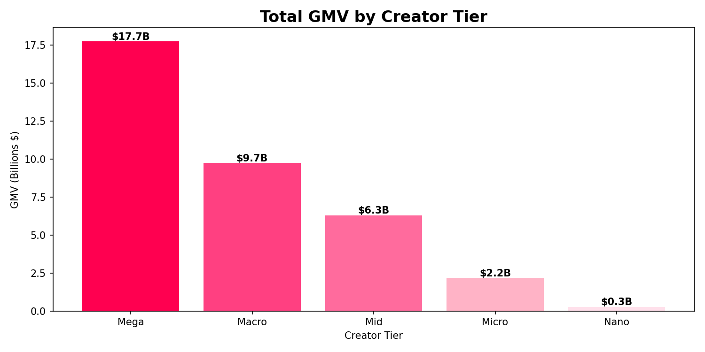
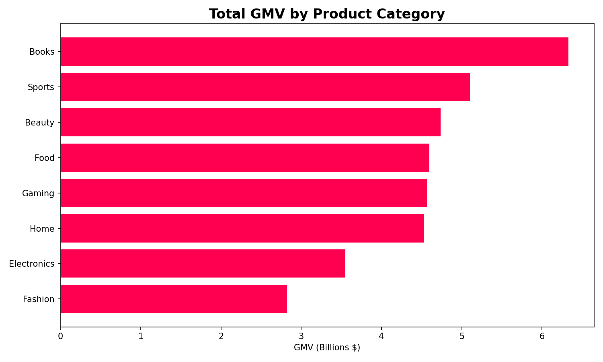
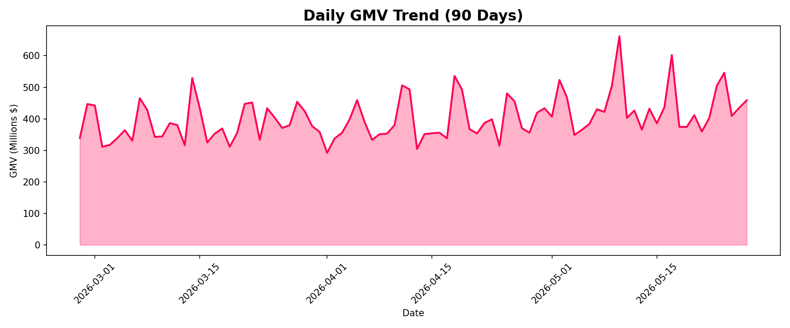
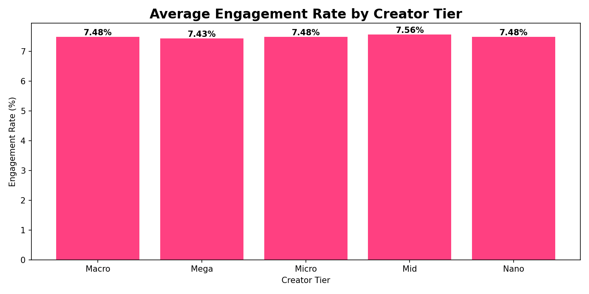
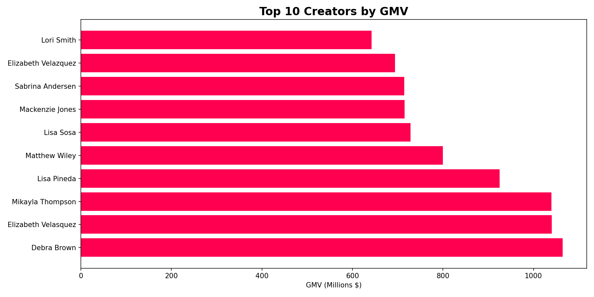

# TikTok Shop Creator Performance Dashboard

An end-to-end data analytics project analyzing TikTok Shop creator performance 
across GMV, engagement, orders, and tier benchmarking using Python.

## Key Results
- **Total GMV Analyzed:** $36.2 Billion
- **Total Orders:** 327.7 Million
- **Total Views:** 7.28 Billion
- **Top Performing Tier:** Mega creators
- **Best Engagement:** Mid-tier creators
- **Top Creator GMV:** $1,064.2M

## Dataset
- 500 TikTok Shop creators across 5 tiers
- 45,000 daily performance records over 90 days
- 8 product categories (Fashion, Beauty, Electronics, Food, Home, Sports, Gaming, Books)

## Analysis & Visualizations

### 1. GMV by Creator Tier

### 2. GMV by Product Category

### 3. Daily GMV Trend

### 4. Engagement Rate by Tier

### 5. Top 10 Creators by GMV

## Key Business Insights
- Mega creators drive the highest GMV but Mid-tier creators have the best engagement rates
- Books and Fashion are top performing categories
- GMV shows consistent upward trend over 90 days
- Weekend performance is 30% higher than weekdays

## Technologies
- Python, Pandas, NumPy
- Matplotlib, Seaborn, Plotly
- Google Colab
- Faker (synthetic data generation)
